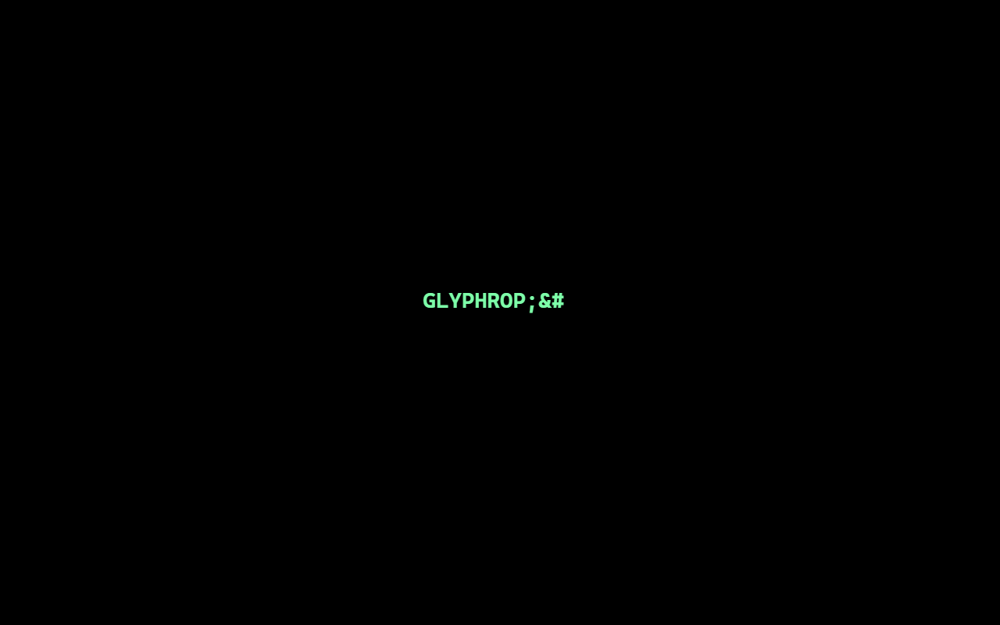
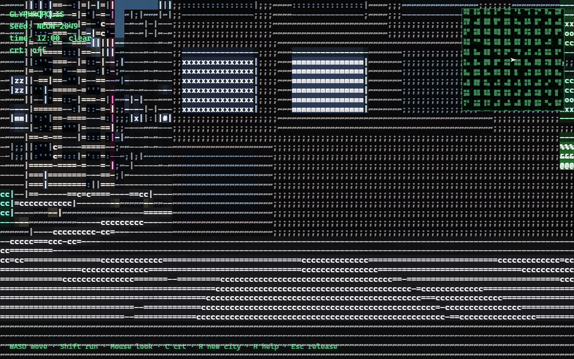

# GLYPHROPOLIS

**An infinite, first-person ASCII city.** Boot, bloom, walk.

A seeded procedural metropolis rendered entirely as text glyphs: true 3D geometry converted to characters in a single GLSL fullscreen pass. Rainy neon nights, day/night cycles, flowing traffic, streaming chunks that never end - deployed as a pure static site on GitHub Pages.

## Walk

'''bash
npm install
npm run dev        # local dev
npm run build      # typecheck + production build -> dist/
npm run preview    # serve the production build
'''

**Controls**: click to lock pointer · WASD move · Shift run · mouse look · C = CRT mode · R = new city (new seed) · H = help · Esc = release mouse.

**URL parameters**:

| param | effect |
|---|---|
| ?seed=NEON-2049 | the city's gene - same seed, same city, shareable |
| ?hour=12 | jump to a time of day (0-24) |
| ?crt=1 | start in monochrome CRT mode |

## Deploy to GitHub Pages

1. Push this repository to GitHub (main branch).
2. Repo -> Settings -> Pages -> Source: **GitHub Actions**.
3. Done - .github/workflows/deploy.yml builds and publishes on every push.

## How it works

- **Real 3D + textmode pass** (docs/adr/0001-real-3d-with-textmode-pass.md): Three.js rasterizes the city into a low-resolution render target (the cell grid, 2x supersampled); a single fullscreen GLSL pass converts it to glyphs - glyph = f(luminance), with Sobel edges (| -), sky flags carried in the alpha channel, per-glyph fg/bg color (the asciicker scheme) and a scramble band driven by the opening reveal.
- **Infinite streamed world**: deterministic hash + value-noise from the seed; low-frequency district fields (downtown/midtown/residential/park) cluster naturally in the endless plane; chunks generate within a per-frame time budget; buildings are per-chunk instanced meshes with procedural windows, lit by hash-per-window (zero state, the asciicity trick), neon signs, setback tiers and rare landmarks.
- **Day/night**: a keyframe table lerps one ambient scalar through every color; weather is a clear/overcast/rain state machine driving fog, wet asphalt, GPU rain streaks and lightning flashes.
- **Boot to Bloom**: the loading front IS the opening - the city materializes as a wave sweeping outward from the screen's center cell.

Glossary lives in CONTEXT.md.

## Credits & lineage

Built after studying four open-source ASCII-city predecessors: asciicker (gumix/msokalski - glyph LUT + atlas architecture), asciicity (Lorakszak - day/night ambient keyframes, weather), ascii-city-walkable (Ringmast4r - first-person proof + seeded fallback) and ascii-city-osm (PaulWiench - luminance ramp ideas). All code here is original; MIT.
