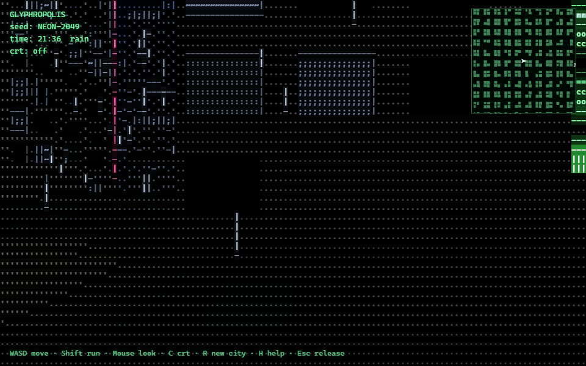

# GLYPHROPOLIS

**An infinite ASCII city.** Run, grapple, glide and fly through a procedural metropolis drawn entirely in text glyphs.

A seeded procedural metropolis rendered entirely as text glyphs: true 3D geometry converted to characters in a single GLSL fullscreen pass. Rainy neon nights, day/night cycles, endless streamed streets - a pure static site.

▶ **Play v2**: https://glyphropolis.adnermo.online/ (third-person: run, grapple, glide, fly, collect glyphs)

▶ **Classic v1**: https://glyphropolis.adnermo.online/v1/ (original first-person walk)



## v2 controls

WASD move · Shift sprint · Space jump (again in the air: fly) · E grapple · mouse look · Tab map · Esc menu.

v2 lives in `g2/` (`cd g2 && npm install && npm run dev`).

## Run v1 locally

```bash
npm install
npm run dev        # dev server
npm run build      # typecheck + production build -> dist/
npm run preview    # serve the production build
```

**Controls**: click to lock pointer · WASD move · Shift run · Space charge eject / thrust · mouse look · C = CRT mode · R = new city · H = help · Esc = release.

**Useful params**: `?seed=NEON-2049` (same seed, same city) · `?hour=12` (time of day) · `?crt=1` (monochrome CRT).

---

Built after studying four open-source ASCII-city predecessors (asciicker, asciicity, ascii-city-walkable, ascii-city-osm). All code original; MIT. Design notes in `docs/adr/`, glossary in `CONTEXT.md`.
